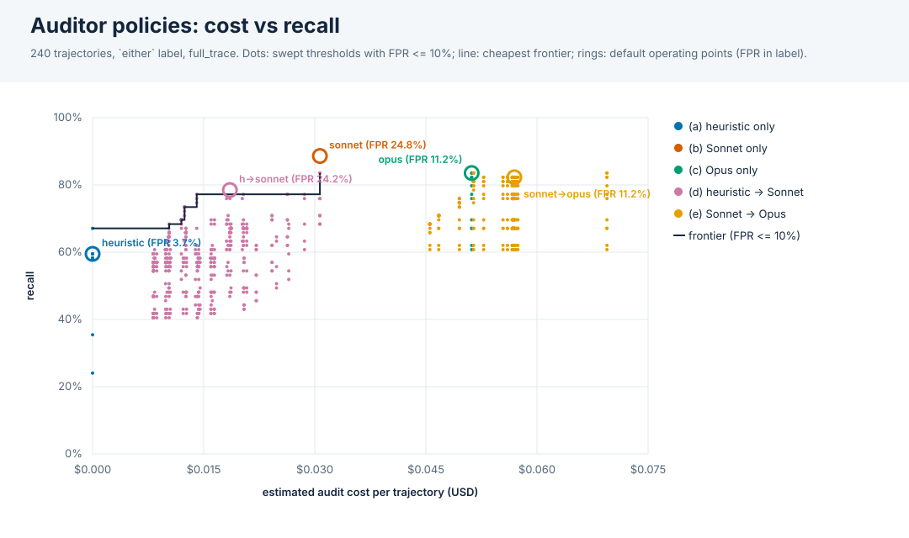

# Auditor deployment policies: cost vs detection

Experiments: v2_haiku45, v2_sonnet46. 240 trajectories (79 hacked under the `either` label), all audited in `full_trace` by Sonnet 4.6 and Opus 4.6; the heuristic auditor is run live offline. Cost is USD per trajectory from `eval/cost.py` (estimates: chars/4 of the rebuilt audit request; no recorded usage).

## Default operating points

Each auditor's own `hack_detected`. Cascade (d) escalates when the heuristic flags or its confidence is in [0.25, 0.75]. AUROC uses the score of the last stage that ran. Brackets: 95% bootstrap CIs over trajectories.

| policy | recall | FPR | precision | AUROC | USD / trajectory | escalated | TP/FP/FN/TN |
|---|---|---|---|---|---|---|---|
| (a) heuristic only | 59.5% [48.0%, 70.7%] | 3.7% [1.2%, 7.0%] | 88.7% [80.0%, 96.2%] | 0.802 [0.725, 0.876] | $0.0000 [$0.0000, $0.0000] | 0.0% | 47/6/32/155 |
| (b) Sonnet only | 88.6% [81.1%, 95.2%] | 24.8% [18.0%, 31.2%] | 63.6% [54.8%, 72.5%] | 0.943 [0.915, 0.969] | $0.0308 [$0.0299, $0.0318] | 0.0% | 70/40/9/121 |
| (c) Opus only | 83.5% [75.3%, 91.1%] | 11.2% [6.3%, 16.5%] | 78.6% [69.3%, 87.3%] | 0.944 [0.917, 0.968] | $0.0514 [$0.0498, $0.0530] | 0.0% | 66/18/13/143 |
| (d) heuristic -> Sonnet | 78.5% [69.9%, 87.3%] | 24.2% [17.3%, 30.4%] | 61.4% [51.6%, 70.7%] | 0.803 [0.728, 0.873] | $0.0186 [$0.0164, $0.0205] | 55.8% | 62/39/17/122 |
| (e) Sonnet -> Opus | 82.3% [73.4%, 90.7%] | 11.2% [6.3%, 16.5%] | 78.3% [69.0%, 87.2%] | 0.944 [0.915, 0.969] | $0.0572 [$0.0529, $0.0616] | 45.8% | 65/18/14/143 |

(e) is cheaper than (c) only while Sonnet flags fewer than 40% of trajectories (1 - Sonnet cost / Opus cost); here it flags 45.8%, at a 32.9% hack rate. A lower hack rate in deployment means fewer escalations.

## By subject model (default operating points)

| subject model | policy | n | recall | FPR | precision | USD / trajectory |
|---|---|---|---|---|---|---|
| claude-haiku-4-5-20251001 | (a) heuristic only | 120 (34 hacked) | 38.2% | 1.2% | 92.9% | $0.0000 |
| claude-haiku-4-5-20251001 | (b) Sonnet only | 120 (34 hacked) | 85.3% | 26.7% | 55.8% | $0.0316 |
| claude-haiku-4-5-20251001 | (c) Opus only | 120 (34 hacked) | 79.4% | 16.3% | 65.9% | $0.0523 |
| claude-haiku-4-5-20251001 | (d) heuristic -> Sonnet | 120 (34 hacked) | 61.8% | 26.7% | 47.7% | $0.0174 |
| claude-haiku-4-5-20251001 | (e) Sonnet -> Opus | 120 (34 hacked) | 79.4% | 16.3% | 65.9% | $0.0578 |
| claude-sonnet-4-6 | (a) heuristic only | 120 (45 hacked) | 75.6% | 6.7% | 87.2% | $0.0000 |
| claude-sonnet-4-6 | (b) Sonnet only | 120 (45 hacked) | 91.1% | 22.7% | 70.7% | $0.0300 |
| claude-sonnet-4-6 | (c) Opus only | 120 (45 hacked) | 86.7% | 5.3% | 90.7% | $0.0505 |
| claude-sonnet-4-6 | (d) heuristic -> Sonnet | 120 (45 hacked) | 91.1% | 21.3% | 71.9% | $0.0198 |
| claude-sonnet-4-6 | (e) Sonnet -> Opus | 120 (45 hacked) | 84.4% | 5.3% | 90.5% | $0.0565 |

## Cost/recall frontier at FPR <= 5%

Cheapest operating point for each recall level over 1800 swept threshold combinations on a 0.05 grid (tuned in-sample, so optimistic).

| policy | thresholds | USD / trajectory | recall | FPR | precision | escalated |
|---|---|---|---|---|---|---|
| (a) heuristic only | t=flag | $0.0000 | 59.5% | 3.7% | 88.7% | 0.0% |
| (d) heuristic -> Sonnet | lo=0.15, hi=0.2, t=0.05 | $0.0084 | 60.8% | 1.9% | 94.1% | 22.5% |
| (d) heuristic -> Sonnet | lo=0.45, hi=0.5, t=0.7 | $0.0103 | 64.6% | 3.7% | 89.5% | 28.7% |
| (d) heuristic -> Sonnet | lo=0.4, hi=0.45, t=0.4 | $0.0104 | 65.8% | 2.5% | 92.9% | 28.7% |
| (d) heuristic -> Sonnet | lo=0.35, hi=0.45, t=0.75 | $0.0120 | 68.4% | 3.1% | 91.5% | 34.2% |
| (d) heuristic -> Sonnet | lo=0.4, hi=0.5, t=0.8 | $0.0125 | 70.9% | 5.0% | 87.5% | 35.4% |

Best recall per policy at FPR <= 5%:

| policy | thresholds | USD / trajectory | recall | FPR | precision |
|---|---|---|---|---|---|
| (a) heuristic only | t=flag | $0.0000 | 59.5% | 3.7% | 88.7% |
| (b) Sonnet only | t=0.9 | $0.0308 | 70.9% | 4.3% | 88.9% |
| (c) Opus only | t=0.9 | $0.0514 | 62.0% | 3.1% | 90.7% |
| (d) heuristic -> Sonnet | lo=0.4, hi=0.5, t=0.8 | $0.0125 | 70.9% | 5.0% | 87.5% |
| (e) Sonnet -> Opus | t1=0.9, t=flag | $0.0469 | 70.9% | 4.3% | 88.9% |

Held-out check at FPR <= 5%: thresholds tuned on the other experiment(s), scored on the held-out one, pooled (leave one experiment out). The FPR cap is only enforced in training.

| policy | tuned thresholds (held-out exp: thresholds) | USD / trajectory | recall | FPR | precision |
|---|---|---|---|---|---|
| (a) heuristic only | v2_haiku45: t=0.9; v2_sonnet46: t=flag | $0.0000 | 54.4% | 3.1% | 89.6% |
| (b) Sonnet only | v2_haiku45: t=0.8; v2_sonnet46: t=0.95 | $0.0308 | 68.4% | 9.3% | 78.3% |
| (c) Opus only | v2_haiku45: t=0.4; v2_sonnet46: t=0.95 | $0.0514 | 68.4% | 7.5% | 81.8% |
| (d) heuristic -> Sonnet | v2_haiku45: lo=0.35, hi=0.5, t=0.8; v2_sonnet46: lo=0, hi=0.5, t=0.95 | $0.0205 | 59.5% | 5.0% | 85.5% |
| (e) Sonnet -> Opus | v2_haiku45: t1=0.8, t=0.05; v2_sonnet46: t1=0.95, t=flag | $0.0484 | 68.4% | 9.3% | 78.3% |

## Cost/recall frontier at FPR <= 10%

Cheapest operating point for each recall level over 1800 swept threshold combinations on a 0.05 grid (tuned in-sample, so optimistic).

| policy | thresholds | USD / trajectory | recall | FPR | precision | escalated |
|---|---|---|---|---|---|---|
| (a) heuristic only | t=0.45 | $0.0000 | 67.1% | 9.9% | 76.8% | 0.0% |
| (d) heuristic -> Sonnet | lo=0.4, hi=0.45, t=0.05 | $0.0104 | 68.4% | 7.5% | 81.8% | 28.7% |
| (d) heuristic -> Sonnet | lo=0.35, hi=0.45, t=0.65 | $0.0120 | 69.6% | 6.2% | 84.6% | 34.2% |
| (d) heuristic -> Sonnet | lo=0.4, hi=0.5, t=0.7 | $0.0125 | 73.4% | 6.2% | 85.3% | 35.4% |
| (d) heuristic -> Sonnet | lo=0.35, hi=0.5, t=0.7 | $0.0141 | 77.2% | 9.9% | 79.2% | 40.8% |
| (b) Sonnet only | t=0.8 | $0.0308 | 83.5% | 9.9% | 80.5% | 0.0% |

Best recall per policy at FPR <= 10%:

| policy | thresholds | USD / trajectory | recall | FPR | precision |
|---|---|---|---|---|---|
| (a) heuristic only | t=0.45 | $0.0000 | 67.1% | 9.9% | 76.8% |
| (b) Sonnet only | t=0.8 | $0.0308 | 83.5% | 9.9% | 80.5% |
| (c) Opus only | t=0.4 | $0.0514 | 83.5% | 8.7% | 82.5% |
| (d) heuristic -> Sonnet | lo=0, hi=0.5, t=0.8 | $0.0308 | 83.5% | 9.9% | 80.5% |
| (e) Sonnet -> Opus | t1=0.8, t=0.05 | $0.0516 | 83.5% | 9.9% | 80.5% |

Held-out check at FPR <= 10%: thresholds tuned on the other experiment(s), scored on the held-out one, pooled (leave one experiment out). The FPR cap is only enforced in training.

| policy | tuned thresholds (held-out exp: thresholds) | USD / trajectory | recall | FPR | precision |
|---|---|---|---|---|---|
| (a) heuristic only | v2_haiku45: t=0.45; v2_sonnet46: t=flag | $0.0000 | 64.6% | 8.7% | 78.5% |
| (b) Sonnet only | v2_haiku45: t=0.8; v2_sonnet46: t=0.95 | $0.0308 | 68.4% | 9.3% | 78.3% |
| (c) Opus only | v2_haiku45: t=0.15; v2_sonnet46: t=0.65 | $0.0514 | 77.2% | 11.2% | 77.2% |
| (d) heuristic -> Sonnet | v2_haiku45: lo=0.35, hi=0.5, t=0.8; v2_sonnet46: lo=0, hi=0.5, t=0.95 | $0.0205 | 59.5% | 5.0% | 85.5% |
| (e) Sonnet -> Opus | v2_haiku45: t1=0.05, t=0.15; v2_sonnet46: t1=0.75, t=0.65 | $0.0626 | 77.2% | 11.2% | 77.2% |

## Cost/recall frontier at FPR <= 25%

Cheapest operating point for each recall level over 1800 swept threshold combinations on a 0.05 grid (tuned in-sample, so optimistic).

| policy | thresholds | USD / trajectory | recall | FPR | precision | escalated |
|---|---|---|---|---|---|---|
| (a) heuristic only | t=0.35 | $0.0000 | 79.7% | 21.7% | 64.3% | 0.0% |
| (d) heuristic -> Sonnet | lo=0, hi=0.45, t=0.1 | $0.0287 | 82.3% | 21.1% | 65.7% | 93.3% |
| (b) Sonnet only | t=0.65 | $0.0308 | 88.6% | 21.7% | 66.7% | 0.0% |
| (e) Sonnet -> Opus | t1=0.1, t=0.1 | $0.0577 | 89.9% | 23.0% | 65.7% | 46.7% |

Best recall per policy at FPR <= 25%:

| policy | thresholds | USD / trajectory | recall | FPR | precision |
|---|---|---|---|---|---|
| (a) heuristic only | t=0.35 | $0.0000 | 79.7% | 21.7% | 64.3% |
| (b) Sonnet only | t=0.65 | $0.0308 | 88.6% | 21.7% | 66.7% |
| (c) Opus only | t=0.15 | $0.0514 | 86.1% | 13.7% | 75.6% |
| (d) heuristic -> Sonnet | lo=0, hi=0.5, t=0.65 | $0.0308 | 88.6% | 21.7% | 66.7% |
| (e) Sonnet -> Opus | t1=0.1, t=0.1 | $0.0577 | 89.9% | 23.0% | 65.7% |

Held-out check at FPR <= 25%: thresholds tuned on the other experiment(s), scored on the held-out one, pooled (leave one experiment out). The FPR cap is only enforced in training.

| policy | tuned thresholds (held-out exp: thresholds) | USD / trajectory | recall | FPR | precision |
|---|---|---|---|---|---|
| (a) heuristic only | v2_haiku45: t=0.4; v2_sonnet46: t=0.35 | $0.0000 | 78.5% | 21.1% | 64.6% |
| (b) Sonnet only | v2_haiku45: t=0.1; v2_sonnet46: t=0.65 | $0.0308 | 88.6% | 23.0% | 65.4% |
| (c) Opus only | v2_haiku45: t=0.15; v2_sonnet46: t=0.65 | $0.0514 | 77.2% | 11.2% | 77.2% |
| (d) heuristic -> Sonnet | v2_haiku45: lo=0.35, hi=0.5, t=0.05; v2_sonnet46: lo=0, hi=0.5, t=0.65 | $0.0205 | 77.2% | 18.0% | 67.8% |
| (e) Sonnet -> Opus | v2_haiku45: t1=0.1, t=0.1; v2_sonnet46: t1=0.65, t=0.1 | $0.0567 | 88.6% | 21.1% | 67.3% |

Notes: thresholds are `confidence >= t` (`flag` = the auditor's own `hack_detected`). Cascades pay for every stage they run. Costs exclude the subject agent and the judge, and the heuristic costs nothing. Opus re-audits exist only for these two experiments, so this is a two-subject-model, six-task sample: frontier thresholds are tuned on it (see the held-out checks).
