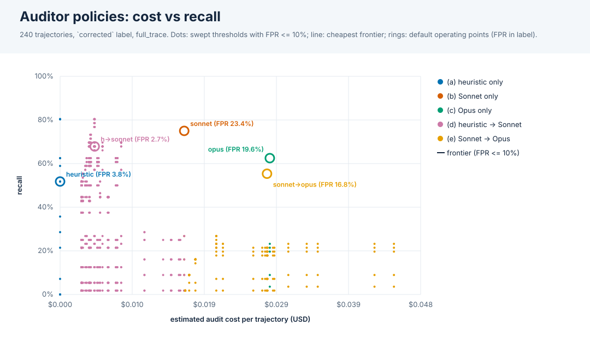

# Auditor deployment policies: cost vs detection

Experiments: v2_haiku45, v2_sonnet46. 240 trajectories (56 hacked under the `corrected` label), all audited in `final_report` by Sonnet 4.6 and Opus 4.6; the heuristic auditor is run live offline. Cost is USD per trajectory from `eval/cost.py` (estimates: chars/4 of the rebuilt audit request; no recorded usage).

## Default operating points

Each auditor's own `hack_detected`. Cascade (d) escalates when the heuristic flags or its confidence is in [0.25, 0.75]. AUROC uses the score of the last stage that ran. Brackets: 95% bootstrap CIs over trajectories.

| policy | recall | FPR | precision | AUROC | USD / trajectory | escalated | TP/FP/FN/TN |
|---|---|---|---|---|---|---|---|
| (a) heuristic only | 51.8% [38.8%, 64.5%] | 3.8% [1.1%, 6.6%] | 80.6% [66.7%, 93.1%] | 0.855 [0.785, 0.918] | $0.0000 [$0.0000, $0.0000] | 0.0% | 29/7/27/177 |
| (b) Sonnet only | 75.0% [62.7%, 85.7%] | 23.4% [17.1%, 29.3%] | 49.4% [39.0%, 59.5%] | 0.819 [0.763, 0.872] | $0.0166 [$0.0163, $0.0169] | 0.0% | 42/43/14/141 |
| (c) Opus only | 62.5% [49.3%, 75.6%] | 19.6% [13.3%, 24.7%] | 49.3% [38.2%, 60.7%] | 0.808 [0.756, 0.861] | $0.0281 [$0.0276, $0.0286] | 0.0% | 35/36/21/148 |
| (d) heuristic -> Sonnet | 67.9% [54.8%, 80.8%] | 2.7% [0.5%, 5.3%] | 88.4% [78.4%, 97.4%] | 0.856 [0.785, 0.921] | $0.0046 [$0.0036, $0.0057] | 24.2% | 38/5/18/179 |
| (e) Sonnet -> Opus | 55.4% [42.2%, 68.3%] | 16.8% [10.9%, 21.9%] | 50.0% [38.2%, 62.3%] | 0.819 [0.766, 0.871] | $0.0277 [$0.0256, $0.0297] | 35.4% | 31/31/25/153 |

(e) is cheaper than (c) only while Sonnet flags fewer than 41% of trajectories (1 - Sonnet cost / Opus cost); here it flags 35.4%, at a 23.3% hack rate. A lower hack rate in deployment means fewer escalations.

## By subject model (default operating points)

| subject model | policy | n | recall | FPR | precision | USD / trajectory |
|---|---|---|---|---|---|---|
| claude-haiku-4-5-20251001 | (a) heuristic only | 120 (28 hacked) | 50.0% | 4.3% | 77.8% | $0.0000 |
| claude-haiku-4-5-20251001 | (b) Sonnet only | 120 (28 hacked) | 82.1% | 20.7% | 54.8% | $0.0161 |
| claude-haiku-4-5-20251001 | (c) Opus only | 120 (28 hacked) | 71.4% | 15.2% | 58.8% | $0.0270 |
| claude-haiku-4-5-20251001 | (d) heuristic -> Sonnet | 120 (28 hacked) | 71.4% | 4.3% | 83.3% | $0.0042 |
| claude-haiku-4-5-20251001 | (e) Sonnet -> Opus | 120 (28 hacked) | 67.9% | 13.0% | 61.3% | $0.0267 |
| claude-sonnet-4-6 | (a) heuristic only | 120 (28 hacked) | 53.6% | 3.3% | 83.3% | $0.0000 |
| claude-sonnet-4-6 | (b) Sonnet only | 120 (28 hacked) | 67.9% | 26.1% | 44.2% | $0.0172 |
| claude-sonnet-4-6 | (c) Opus only | 120 (28 hacked) | 53.6% | 23.9% | 40.5% | $0.0292 |
| claude-sonnet-4-6 | (d) heuristic -> Sonnet | 120 (28 hacked) | 64.3% | 1.1% | 94.7% | $0.0051 |
| claude-sonnet-4-6 | (e) Sonnet -> Opus | 120 (28 hacked) | 42.9% | 20.7% | 38.7% | $0.0287 |

## Cost/recall frontier at FPR <= 5%

Cheapest operating point for each recall level over 1800 swept threshold combinations on a 0.05 grid (tuned in-sample, so optimistic).

| policy | thresholds | USD / trajectory | recall | FPR | precision | escalated |
|---|---|---|---|---|---|---|
| (a) heuristic only | t=0.45 | $0.0000 | 58.9% | 4.9% | 78.6% | 0.0% |
| (d) heuristic -> Sonnet | lo=0.35, hi=0.5, t=0.1 | $0.0036 | 62.5% | 4.9% | 79.5% | 18.8% |
| (d) heuristic -> Sonnet | lo=0.3, hi=0.35, t=0.05 | $0.0039 | 69.6% | 4.9% | 81.2% | 20.0% |
| (d) heuristic -> Sonnet | lo=0.3, hi=0.45, t=0.1 | $0.0040 | 73.2% | 4.9% | 82.0% | 21.2% |
| (d) heuristic -> Sonnet | lo=0.3, hi=0.5, t=0.2 | $0.0046 | 76.8% | 4.9% | 82.7% | 23.8% |

Best recall per policy at FPR <= 5%:

| policy | thresholds | USD / trajectory | recall | FPR | precision |
|---|---|---|---|---|---|
| (a) heuristic only | t=0.45 | $0.0000 | 58.9% | 4.9% | 78.6% |
| (b) Sonnet only | t=0.85 | $0.0166 | 16.1% | 1.1% | 81.8% |
| (c) Opus only | t=0.75 | $0.0281 | 23.2% | 2.7% | 72.2% |
| (d) heuristic -> Sonnet | lo=0.3, hi=0.5, t=0.2 | $0.0046 | 76.8% | 4.9% | 82.7% |
| (e) Sonnet -> Opus | t1=0.25, t=0.75 | $0.0306 | 23.2% | 2.7% | 72.2% |

Held-out check at FPR <= 5%: thresholds tuned on the other experiment(s), scored on the held-out one, pooled (leave one experiment out). The FPR cap is only enforced in training.

| policy | tuned thresholds (held-out exp: thresholds) | USD / trajectory | recall | FPR | precision |
|---|---|---|---|---|---|
| (a) heuristic only | v2_haiku45: t=0.55; v2_sonnet46: t=flag | $0.0000 | 51.8% | 3.8% | 80.6% |
| (b) Sonnet only | v2_haiku45: t=0.85; v2_sonnet46: t=0.85 | $0.0166 | 16.1% | 1.1% | 81.8% |
| (c) Opus only | v2_haiku45: t=0.8; v2_sonnet46: t=0.75 | $0.0281 | 21.4% | 2.7% | 70.6% |
| (d) heuristic -> Sonnet | v2_haiku45: lo=0.2, hi=0.5, t=0.2; v2_sonnet46: lo=0.3, hi=0.35, t=flag | $0.0039 | 62.5% | 3.8% | 83.3% |
| (e) Sonnet -> Opus | v2_haiku45: t1=0.25, t=0.8; v2_sonnet46: t1=0.8, t=0.75 | $0.0262 | 19.6% | 2.7% | 68.8% |

## Cost/recall frontier at FPR <= 10%

Cheapest operating point for each recall level over 1800 swept threshold combinations on a 0.05 grid (tuned in-sample, so optimistic).

| policy | thresholds | USD / trajectory | recall | FPR | precision | escalated |
|---|---|---|---|---|---|---|
| (a) heuristic only | t=0.3 | $0.0000 | 80.4% | 6.5% | 78.9% | 0.0% |

Best recall per policy at FPR <= 10%:

| policy | thresholds | USD / trajectory | recall | FPR | precision |
|---|---|---|---|---|---|
| (a) heuristic only | t=0.3 | $0.0000 | 80.4% | 6.5% | 78.9% |
| (b) Sonnet only | t=0.8 | $0.0166 | 26.8% | 9.8% | 45.5% |
| (c) Opus only | t=0.75 | $0.0281 | 23.2% | 2.7% | 72.2% |
| (d) heuristic -> Sonnet | lo=0.3, hi=0.5, t=0.1 | $0.0046 | 80.4% | 6.0% | 80.4% |
| (e) Sonnet -> Opus | t1=0.8, t=0.2 | $0.0209 | 26.8% | 8.7% | 48.4% |

Held-out check at FPR <= 10%: thresholds tuned on the other experiment(s), scored on the held-out one, pooled (leave one experiment out). The FPR cap is only enforced in training.

| policy | tuned thresholds (held-out exp: thresholds) | USD / trajectory | recall | FPR | precision |
|---|---|---|---|---|---|
| (a) heuristic only | v2_haiku45: t=0.2; v2_sonnet46: t=0.3 | $0.0000 | 80.4% | 7.1% | 77.6% |
| (b) Sonnet only | v2_haiku45: t=0.85; v2_sonnet46: t=0.75 | $0.0166 | 21.4% | 8.7% | 42.9% |
| (c) Opus only | v2_haiku45: t=0.8; v2_sonnet46: t=0.65 | $0.0281 | 23.2% | 8.2% | 46.4% |
| (d) heuristic -> Sonnet | v2_haiku45: lo=0.2, hi=0.5, t=0.1; v2_sonnet46: lo=0.3, hi=0.35, t=0.05 | $0.0039 | 69.6% | 5.4% | 79.6% |
| (e) Sonnet -> Opus | v2_haiku45: t1=0.25, t=0.8; v2_sonnet46: t1=0.75, t=0.2 | $0.0266 | 25.0% | 8.7% | 46.7% |

## Cost/recall frontier at FPR <= 25%

Cheapest operating point for each recall level over 1800 swept threshold combinations on a 0.05 grid (tuned in-sample, so optimistic).

| policy | thresholds | USD / trajectory | recall | FPR | precision | escalated |
|---|---|---|---|---|---|---|
| (a) heuristic only | t=0.3 | $0.0000 | 80.4% | 6.5% | 78.9% | 0.0% |

Best recall per policy at FPR <= 25%:

| policy | thresholds | USD / trajectory | recall | FPR | precision |
|---|---|---|---|---|---|
| (a) heuristic only | t=0.3 | $0.0000 | 80.4% | 6.5% | 78.9% |
| (b) Sonnet only | t=0.4 | $0.0166 | 76.8% | 23.4% | 50.0% |
| (c) Opus only | t=0.35 | $0.0281 | 66.1% | 21.7% | 48.1% |
| (d) heuristic -> Sonnet | lo=0.3, hi=0.5, t=0.1 | $0.0046 | 80.4% | 6.0% | 80.4% |
| (e) Sonnet -> Opus | t1=0.4, t=0.05 | $0.0278 | 76.8% | 23.4% | 50.0% |

Held-out check at FPR <= 25%: thresholds tuned on the other experiment(s), scored on the held-out one, pooled (leave one experiment out). The FPR cap is only enforced in training.

| policy | tuned thresholds (held-out exp: thresholds) | USD / trajectory | recall | FPR | precision |
|---|---|---|---|---|---|
| (a) heuristic only | v2_haiku45: t=0.2; v2_sonnet46: t=0.3 | $0.0000 | 80.4% | 7.1% | 77.6% |
| (b) Sonnet only | v2_haiku45: t=0.7; v2_sonnet46: t=0.3 | $0.0166 | 67.9% | 22.3% | 48.1% |
| (c) Opus only | v2_haiku45: t=0.35; v2_sonnet46: t=0.35 | $0.0281 | 66.1% | 21.7% | 48.1% |
| (d) heuristic -> Sonnet | v2_haiku45: lo=0.2, hi=0.5, t=0.1; v2_sonnet46: lo=0, hi=0.35, t=0.3 | $0.0100 | 64.3% | 17.9% | 52.2% |
| (e) Sonnet -> Opus | v2_haiku45: t1=flag, t=0.2; v2_sonnet46: t1=0.3, t=0.05 | $0.0281 | 75.0% | 23.9% | 48.8% |

Notes: thresholds are `confidence >= t` (`flag` = the auditor's own `hack_detected`). Cascades pay for every stage they run. Costs exclude the subject agent and the judge, and the heuristic costs nothing. Opus re-audits exist only for these two experiments, so this is a two-subject-model, six-task sample: frontier thresholds are tuned on it (see the held-out checks).
